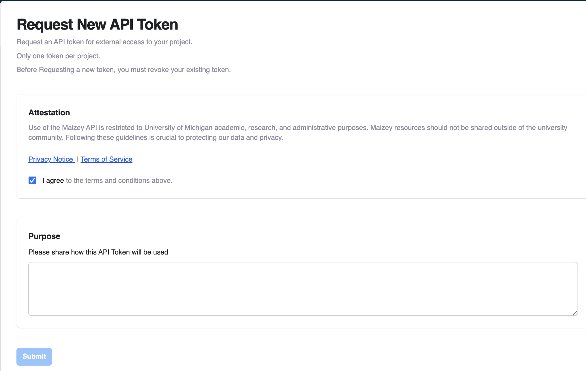
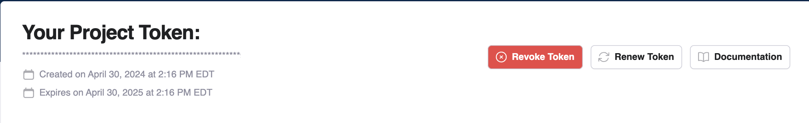
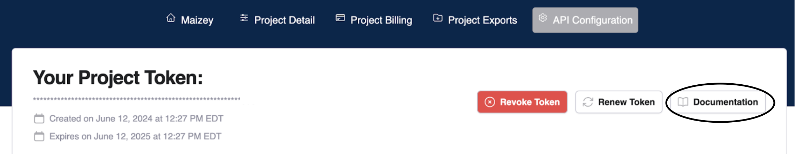
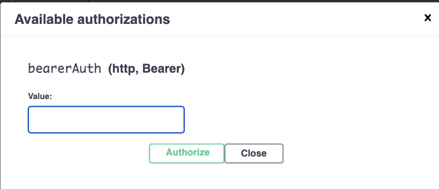
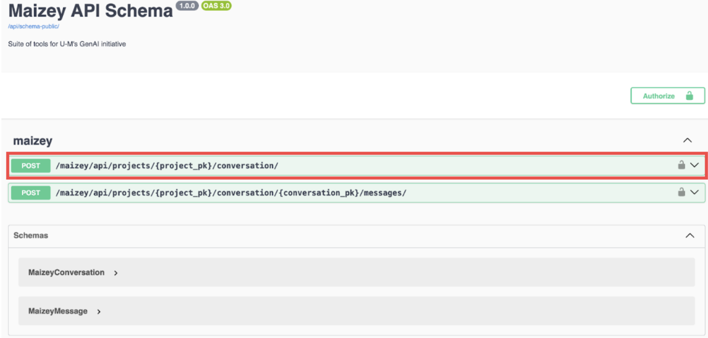
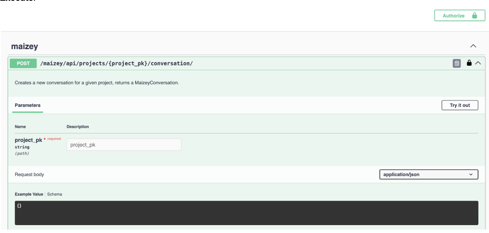
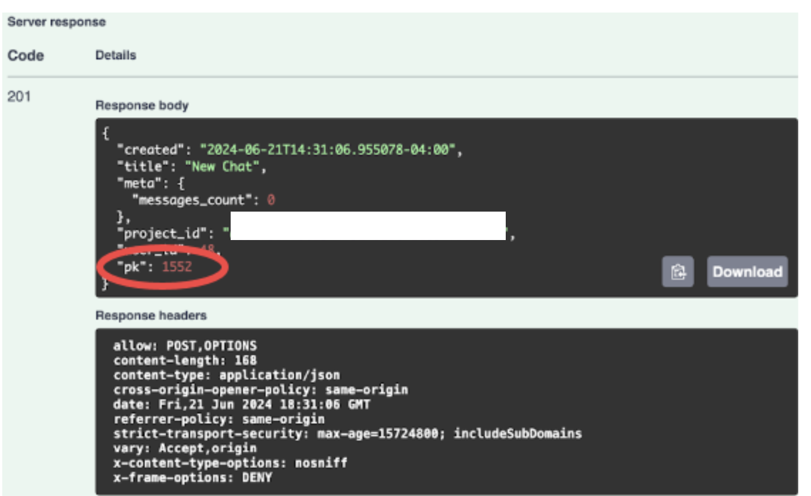
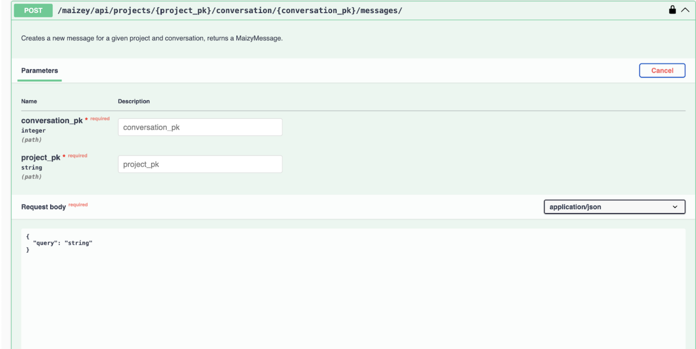
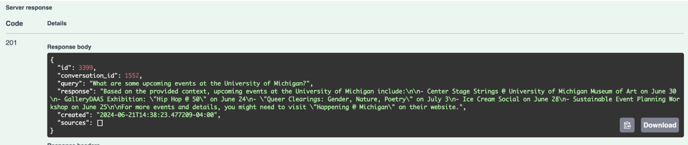
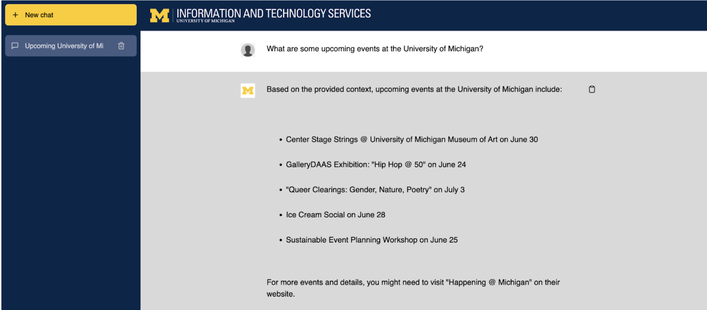

# U-M Maizey API - Create an API Key

Once you’ve created and established the initial configuration of your Maizey project, you’ll have access to the **Details** panel. In the top-right, click the **API Configuration** tab.

To create a new API token, agree to the terms and conditions and provide a purpose for the token, and then click **Submit**. A pop-up window displays with your token. **Save it in a secure location; you will not be able to see it again after you close the popup.**

The API Configuration tab then displays an overview of all the events using that token. Click the **Documentation** button for information about how to use your token.

# Navigating the U-M Maizey API Documentation

After opening your project, click the **API Configuration** tab, and then click the **Documentation** button.

The following page displays, detailing Maizey’s API schema and allowing developers to try it out. To begin, click **Authorize** and paste your token in. Then, open the first collapsible panel. This endpoint allows you to create a MaizeyConversation.

Click **Try it out**, then navigate to the **Project Detail** page for your Maizey project and copy the **Project GUID**. Paste your GUID into the **project_pk** field in the documentation. Finally, scroll down and click **Execute**. 

In the response, copy the number next to **“pk”**: (**1552** in the example pictured below). 

Open the second collapsible and click **Try it out**. Paste your **pk** into **conversation_pk** (it should be the integer from earlier). Then, paste your **Project GUID** into **project_pk**. In the **Request body**, replace **“string”** with your query. Scroll down and click **Execute**. It may take a moment to load.

The output will contain Maizey’s response.

If you go back to your Maizey project, you will see that your query and response will also be reflected as a new chat. Remember that there is no endpoint for managing or deleting conversations or messages.

